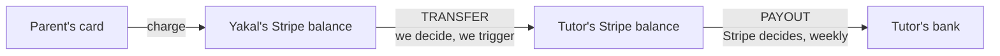
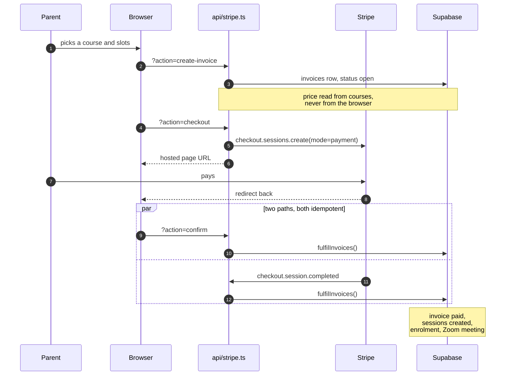
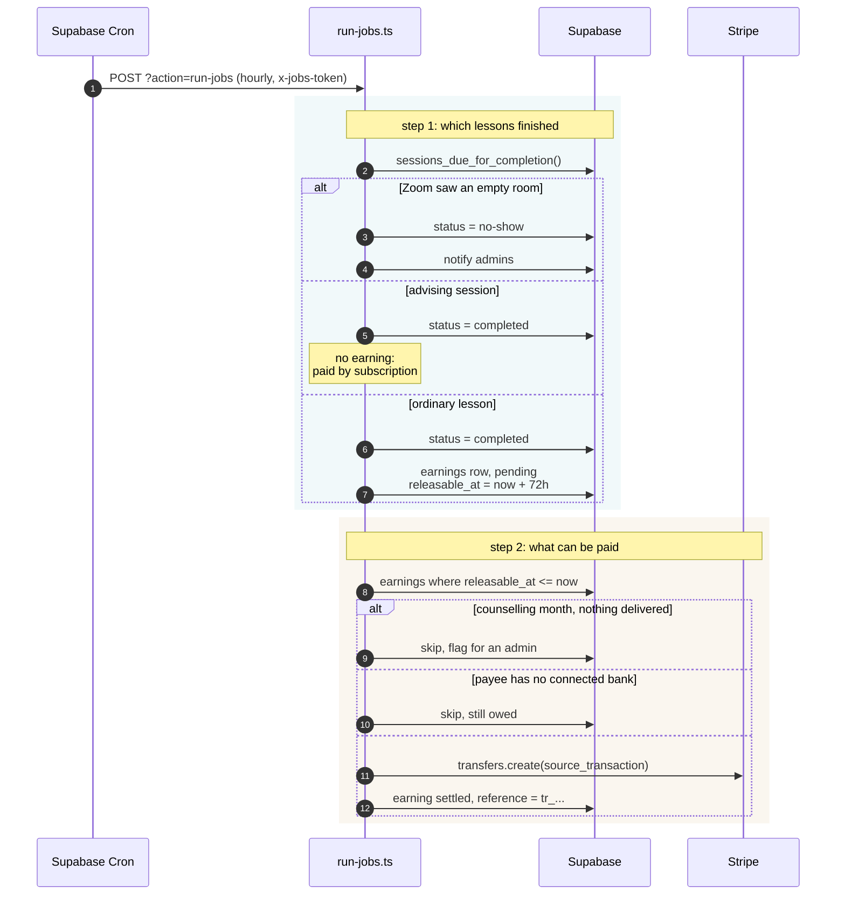
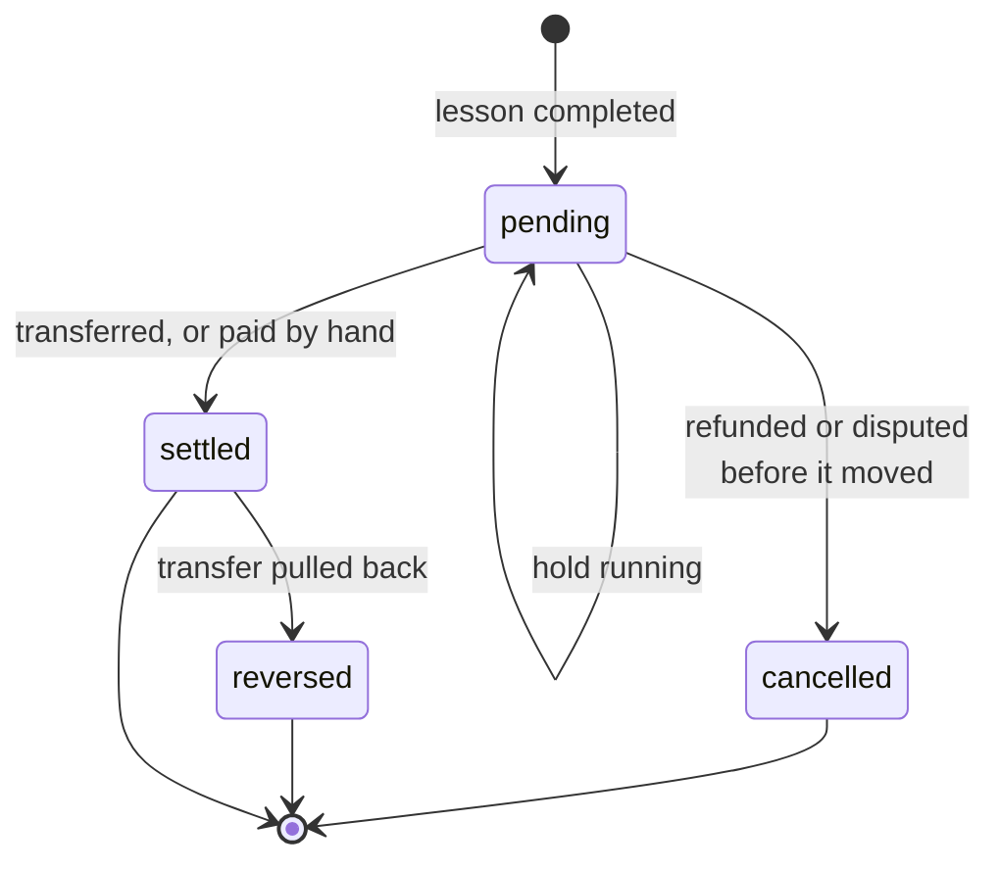
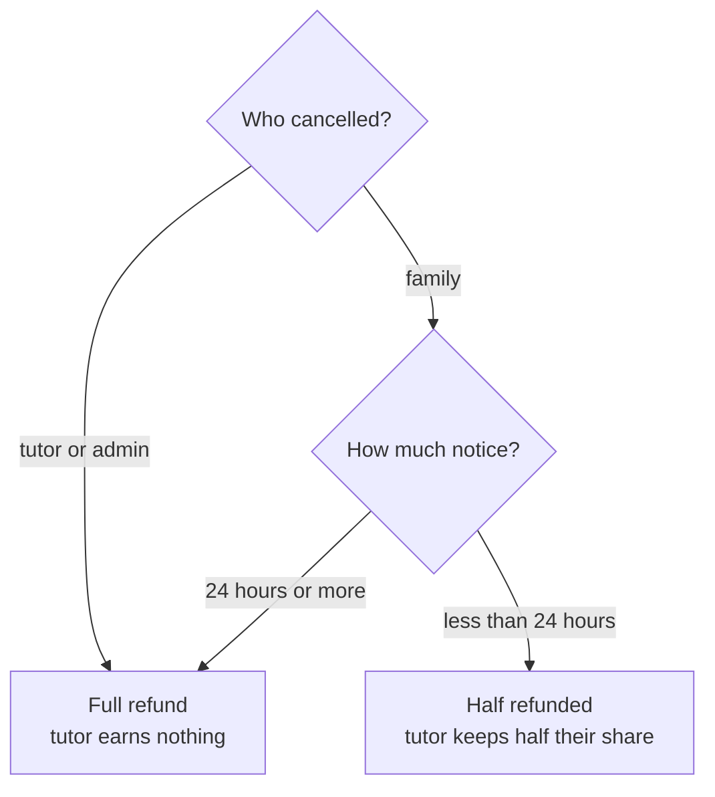
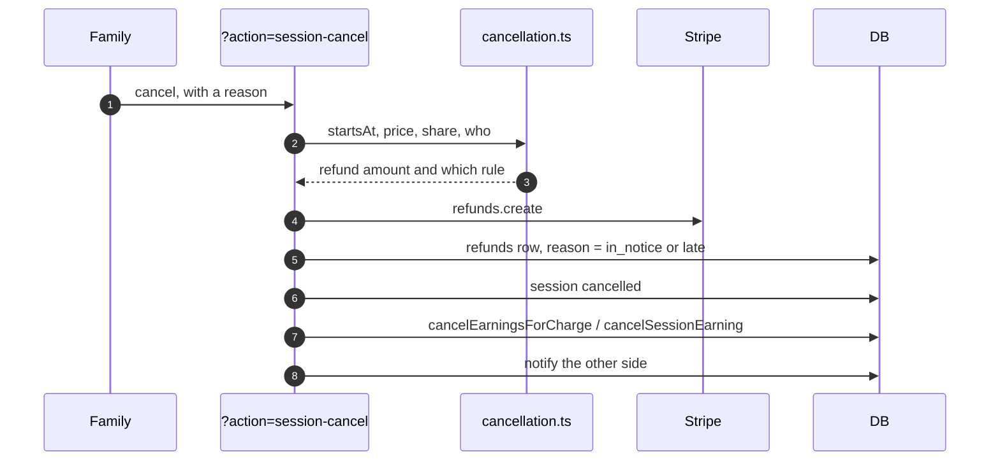
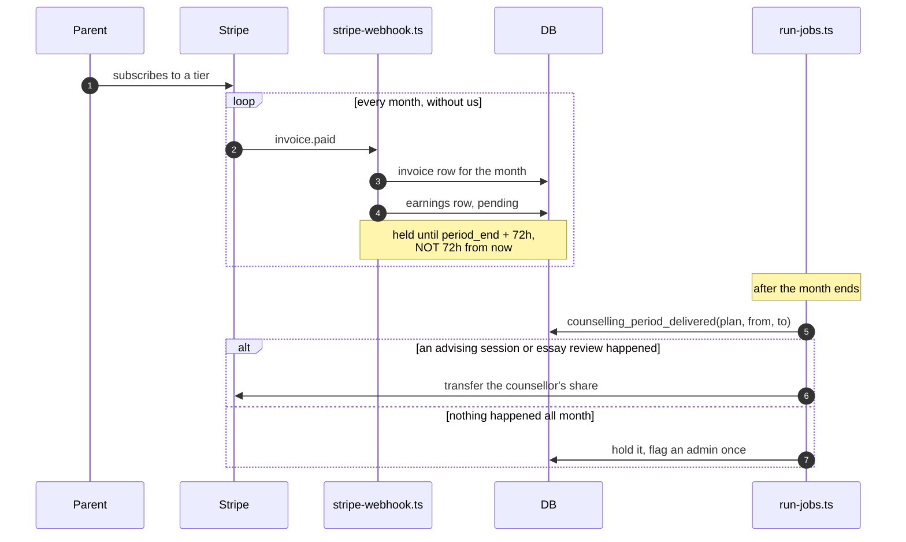
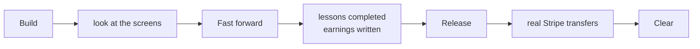

# How the money actually moves

A map of the payment system, written to be read rather than skimmed. Every box
names the real file, so anything here can be checked against the code.

If you read one thing, read the next section. Most confusion about this system
comes from collapsing two different money movements into one word.

---

## 1. Two movements, not one

| | Transfer | Payout |
| --- | --- | --- |
| Moves money from | Yakal's Stripe balance | the tutor's Stripe balance |
| Moves money to | the tutor's Stripe balance | the tutor's real bank |
| Who triggers it | **us**, from the scheduled job | **Stripe**, on a schedule |
| Can it be undone | yes, while unpaid out | **no** |
| Costs | nothing | nothing (1% only for instant) |

**Stripe cannot schedule a transfer.** There is no API for "pay this tutor on
Friday if the lesson happened", because Stripe has no idea whether a lesson
happened. That judgement is ours, which is why a cron job exists at all.

Everything after the transfer is Stripe's problem and we never call
`payouts.create`.

---

## 2. The cast

| Table | What one row means |
| --- | --- |
| `invoices` | a family owes, or has paid, for something |
| `sessions` | one booked hour, and what became of it |
| `earnings` | **money owed to a tutor or counsellor.** The ledger |
| `refunds` | money given back, and which rule produced it |
| `admissions_plans` | a live counselling subscription |

`earnings` is the centre. One rule governs it, written at the top of
`api/_utils/earnings.ts`:

> Nothing is transferred to a payee before the work is delivered.

---

## 3. Buying tutoring

**Why two paths.** The webhook is the source of truth in production, but it
cannot reach `localhost`. So the browser also confirms on return. Both only
touch invoices still `open`, so whichever arrives first wins and the second is a
no-op.

**Nothing is owed to the tutor yet.** No `earnings` row exists. That is correct:
the lessons have not happened.

Files: `api/_handlers/create-invoice.ts`, `stripe-checkout.ts`,
`stripe-confirm.ts`, `api/_utils/fulfil.ts`

---

## 4. A lesson becoming money

This is the part that is hard to watch, because it is driven by a clock.

**Every step is idempotent.** Cron firing twice, a retry after a timeout, or
somebody curling it out of curiosity all have to be harmless. Each step is
written as "move rows still in the previous state", never "do it again".

Files: `api/_handlers/run-jobs.ts`, `api/_utils/earnings.ts`

**To watch this without waiting:** `/dev` > Money states > **Fast forward**,
then **Release**.

---

## 5. The states a payment passes through

| Status | What the tutor sees | What it means |
| --- | --- | --- |
| `pending`, hold running | **Clearing** | earned, not yet movable |
| `pending`, hold expired | **Due** | movable, waiting on a bank or the next run |
| `settled` | **Paid** | money left our balance |
| `cancelled` | | never became payable |
| `reversed` | | moved, then pulled back |

**"Clearing" is the 72 hour hold**, and the header figure of the same name is
the total sitting in it.

---

## 6. Cancelling, and who pays

The published policy at `/cancellation-policy` is implemented in
`api/_utils/cancellation.ts`. It is pure arithmetic with no side effects, which
is why it can be unit-tested without a database.

**This is why the hold matters.** A refund while the earning is still `pending`
costs one database update. After it has settled, the money is in the tutor's
Stripe balance, and once Stripe has paid that out to their bank it cannot be
recovered at all.

---

## 7. Counselling, which is a subscription

**The counsellor is paid for a month at the end of it, and only if they worked.**
Until recently the share was recorded at renewal and released 72 hours later, so
a plan renewing on the 1st paid on the 4th for a month nobody had done yet.

The delivery bar is deliberately low: one completed advising session, or one
essay returned or approved. It separates a counsellor who worked from one who
was never there. It is not a judgement about value, which is a person's job.

---

## 8. Where each thing shows up

| Step | Tutor | Parent | Admin |
| --- | --- | --- | --- |
| paid | | `/parent/billing` | `/admin/billing` invoices |
| lesson completed | `/tutor/sessions` | child's calendar | invoice detail |
| earning written | `/tutor/earnings` Clearing | | Owed |
| hold expired | Due | | Owed, actionable |
| transferred | Paid, with `tr_` | | settled |
| paid outside Stripe | Paid, with a reference | | Tax forms |
| year end | | | Tax forms, over $600 |

---

## 9. What fails silently

Every one of these has bitten already. None of them errors anywhere a person
would look.

| If this is missing | What happens |
| --- | --- |
| `STRIPE_CONNECT_WEBHOOK_SECRET` | nobody who connects a bank is marked payable, ever |
| the cron schedule | nothing completes, nobody is paid |
| `JOBS_TOKEN` mismatch | the job 401s hourly, no money moves |
| a Connect endpoint made without `connect: true` | looks identical, delivers nothing |
| `APP_BASE_URL` set to localhost in the cron | fires hourly, reaches nothing |

`GET /api/healthz` checks the first three. The rest are in
`docs/PAYMENTS_SETUP.md`.

---

## 10. Testing it without waiting

On `/dev`, under **Money states**. Same actions as `npm run scenarios`.

**Booking at 1 AM is impossible and always will be.** `tutor_availability` is
thirteen rows starting at 8 AM because `book_advising_session` computes
`hour - 8`. There is no row for 1 AM. Book at an hour the tutor offers, on any
future date, then **Fast forward** moves the data instead of the clock.

---

## 11. Attendance evidence, and what it costs

Two sources, and they are not equal.

| | `session_attendance` | Zoom `meeting.ended` webhook |
| --- | --- | --- |
| Where from | our own meeting client, by heartbeat | Zoom's API |
| Identifies people by | signed-in user id | a display name they typed |
| Cost | free | **needs a paid Zoom plan** |
| Covers in-person lessons | n/a | no |

`/past_meetings/{id}/participants` answers *"Only available for Paid or ZMP
account"* on the free tier. So the free, reliable source is our own
`session_attendance` table, recorded by heartbeat so a tab left open banks
nothing.

The one thing Zoom says with confidence is that **nobody joined at all**, and
that alone holds a session back for review.
