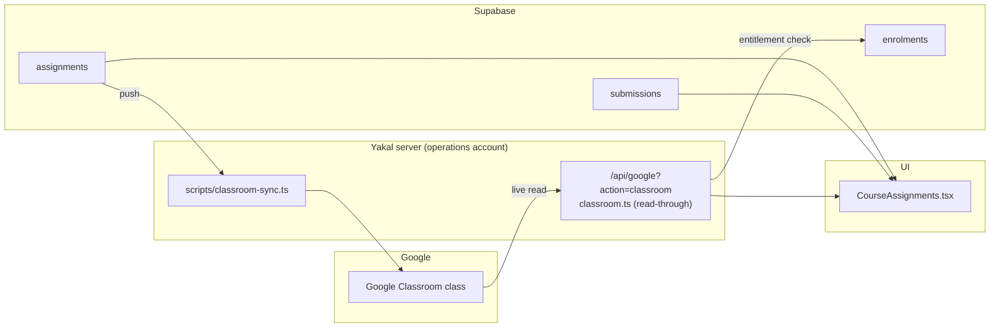

# Google Classroom integration: design and plan

Status: proposed. This is the design for finishing the Classroom integration so a
student, once they have paid for a course, can see its **topics**, its
**assignments**, and their own **progress**, and so a tutor and student can work
the same set of work. It records what already exists, the gaps, the recommended
shape, and a phased plan.

## The problem

A student with access to a course has no coherent place to see the topic an
assignment belongs to, or how far through the work they are. Assignments render
as a flat list with no unit grouping, and "topics" (Classroom's own grouping)
are not read at all. Progress is not rolled up anywhere the student or parent
can see it.

## What already exists

The hard architectural decision was already made well, and most of the plumbing
is in place.

- **`courses.google_classroom_url`** links a Yakal course to a real Classroom
  class.
- **Operations-account read-through** (`api/_handlers/classroom.ts`): the server
  holds one Google credential (`GOOGLE_OAUTH_REFRESH_TOKEN`) that owns every
  class. No student, tutor, or parent ever signs into Google. Each request is
  checked against Yakal's own entitlement first (admin, the course's tutor, an
  enrolled student, or a parent of one), then it live-fetches **published
  `courseWork`** and maps it to the same shape as a native assignment. It already
  translates a dead token (`invalid_grant`) into a clear message.
- **Push sync** (`scripts/classroom-sync.ts`): pushes Yakal-authored assignments
  up into the linked class, writing the resulting page back to
  `assignments.template_url`.
- **Native `assignments` + `submissions`** (with `grade`, `materials` jsonb),
  deliberately shaped to match Classroom's output so one component renders both.
  RLS lets an enrolled student and their parent read the work.
- **`CourseAssignments`** (`src/components/shared/CourseAssignments.tsx`), shared
  by the admin, tutor and student course pages, **merges** the read-through with
  native rows and de-duplicates a synced row against the Classroom entry it
  created. It reads through `getCourseWorkFor` (`src/services/courseWork.ts`).

## The gaps

1. **Topics are never fetched.** `classroom.ts` lists `courseWork` but never
   `courses.topics`, nothing groups assignments by unit, and the UI is a flat
   list. This is the primary thing the student is missing.
2. **No stable link between a Classroom-defined assignment and native progress.**
   Native `submissions` (and their grade) key on `assignments.id`. A piece of
   work written directly in Classroom has only a Classroom `courseWork` id, so a
   student's turn-in and grade have nowhere local to attach. Today the two are
   reconciled by matching a URL, which is brittle.
3. **Progress is not surfaced.** There is no course-level rollup (how many done,
   graded) that the student or parent can see, and no first-class turn-in flow.

## Recommended shape

Keep the model everything else already rests on: **nobody signs into Google.**

- **Classroom is the source of _definitions_** — topics and assignments. Finish
  the read-through so it also returns topics and groups work under them.
- **Yakal is the _workspace_** — turning in, grading, and feedback live in Yakal
  against the native `submissions` table. This preserves the no-sign-in model,
  gives real-time progress with no per-student Google identity, and keeps one
  place for a tutor and student to work.
- **Bridge the two with one column: `assignments.external_id`** (the Classroom
  `courseWork` id). A read-through item is upserted into `assignments` keyed by
  `external_id`, so a single row carries both the Classroom-authored definition
  and Yakal-native progress. This replaces the brittle URL match in
  `CourseAssignments`.

### Why not the alternatives

- **Classroom as the workspace** (students turn in and are graded inside
  Classroom): breaks the no-sign-in model — every student would need a Google
  account and class membership, and Yakal could not show real-time submission or
  grade state without mapping each student's Google identity.
- **Pure live read-through, no cache**: elegant, but it cannot hold native
  progress against a Classroom item, and it blanks the page on a Google outage or
  an expired operations token. The `external_id` upsert keeps freshness while
  giving progress somewhere to live.

## Data model changes

- `assignments.external_id text` — the Classroom `courseWork` id. Unique per
  course. Null for a purely Yakal-authored row that has not been pushed. Replaces
  the `template_url` URL-matching as the identity between local and Classroom.
- Topic grouping, either:
  - `assignments.topic_id text` + `assignments.topic_name text` (denormalised,
    simplest), or
  - a `course_topics` table (`id, course_id, external_id, name, sort_order`) with
    `assignments.topic_id` referencing it (cleaner ordering, one row per topic).
  Recommendation: start denormalised on `assignments`; promote to a table only if
  topic ordering or per-topic metadata is needed.
- `submissions` already has `grade`; no change for grading itself.

All additive, nullable, `IF NOT EXISTS`, `REVOKE ALL` then grant per the house
migration pattern; no RLS widening (existing `assignments`/`submissions`
policies already scope to enrolled students and their parents).

## API changes

- `classroom.ts`: also call `classroom.courses.topics.list`, and read each
  `courseWork.topicId`. Return `{ topics: [{ id, name }], assignments: [...] }`
  with each assignment carrying `topicId`.
- `CourseWorkResult` (`courseWork.ts`) and `ClassroomAssignment`
  (`classroomService.ts`) gain `topicId`/`topics`.
- Optional reconciliation step (Phase 2): when the read-through runs, upsert each
  Classroom `courseWork` into `assignments` by `external_id`, so native progress
  can attach and the list survives a Google hiccup.

## UI changes

- `CourseAssignments`: group the merged list by topic (sections or an
  accordion), topics in Classroom's order, an "Ungrouped" bucket last. Show each
  assignment's own status — turned in / graded / not started — from native
  `submissions`.
- Student course dashboard: a progress rollup (e.g. `7 / 12 done`, average grade)
  built from `submissions`, reusing the `completedTasks / totalTasks` already on
  the card.
- Tutor course page: grade + feedback on a submission (writes native
  `submissions.grade` and a comment).

## Progress, turn-in and grading

- A student turns work in from Yakal: marks done and/or attaches a link; this is
  a native `submissions` row (`status`, optional link). No Google identity
  needed.
- A tutor grades and comments in Yakal against that submission
  (`submissions.grade`, feedback). Progress is derived from these rows.
- Optional "Open in Classroom" deep-link on any assignment that has a Classroom
  page, for anyone who does keep their own Google workflow.

## Phased plan

- **P1 - Topics (the direct ask).** Fetch `courses.topics` in `classroom.ts`,
  thread `topicId` through `CourseWorkResult`/`ClassroomAssignment`, and group the
  list in `CourseAssignments`. Small, self-contained, no schema change if topics
  are read live and grouped in memory. Ships the "see the topic" outcome first.
- **P2 - Bridge.** Add `assignments.external_id` + topic columns; upsert
  read-through items into `assignments` by `external_id`; replace the URL match in
  `CourseAssignments`. Now progress can attach to any assignment, Classroom-
  authored or not.
- **P3 - Workspace + progress.** Native turn-in and grade/feedback UI; course-
  level progress rollup on the student dashboard and the parent's view.
- **P4 - Optional two-way.** Write a grade back to Classroom, for classes a tutor
  also runs there. Needs the `classroom.coursework.students` scope the sync
  already asks for; strictly optional.

## Decisions still open for a human

- **Who authors content**: Classroom-first (tutors write in Classroom, Yakal
  reads) or Yakal-first (authored in the admin, pushed by the sync). The design
  supports both; the read-through + `external_id` bridge does not force a choice,
  but the team should pick a default so tutors are told one place to write.
- **Grade write-back (P4)**: worth it, or is Yakal-native grading the whole
  story? Two-way sync is the most moving parts to keep consistent.

## Operational notes

- The operations-account refresh token expires weekly while the OAuth app sits in
  "Testing"; publish the consent screen so it stops. `classroom.ts` already
  surfaces `invalid_grant` with the fix. Re-mint with
  `scripts/google-oauth-setup.mjs`.
- The read-through is a live call to Google per course view; it is already
  behind an entitlement check and returns a clear degraded state when a course
  has no class attached (`linked: false`).
