# Student and Counselor Data Flows

**Investigation date:** 2026-08-24

**Scope:** Current Yakal repository implementation

**Method:** Read-only review of routes, services, migrations, RLS policies, verification scripts, and architecture documentation.

## Executive summary

Yakal connects a student and counselor through five main data paths:

1. A paid admissions plan assigns a counselor to the student.
2. Both parties communicate through realtime one-to-one messaging.
3. Both parties work from a shared admissions workspace.
4. Counselors review essays and create an auditable review history.
5. The family books advising sessions that appear on both calendars.

The shared-workspace model is a strong foundation because the student and counselor operate on the same records instead of maintaining separate copies. The assignment model also correctly recognizes the paid admissions plan as the relationship that authorizes access.

The investigation found four important implementation inconsistencies:

1. Counselor assignment is not consistently enforced across every admissions table. Several older RLS policies still appear to authorize any counselor instead of only the assigned counselor.
2. Advising sessions store the counselor in `sessions.tutor_id`, while the counselor session-list service queries `sessions.counselor_id`, which does not exist.
3. The student interface says only a parent may book advising, while the database function permits either the student or an actively linked parent.
4. Essay-review notifications link to `/student/essays`, but that route is not registered. The current application workspace route is `/student/my-app`.

No code or data was changed during the investigation.

## System boundary

The browser communicates directly with Supabase for most state. Supabase Auth identifies the caller, PostgreSQL RLS determines which rows the caller may access, and Supabase Realtime delivers message changes. Serverless functions are used only where provider secrets or service-role access are required.

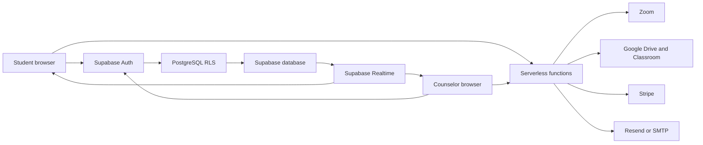

## Overall student-counselor flow

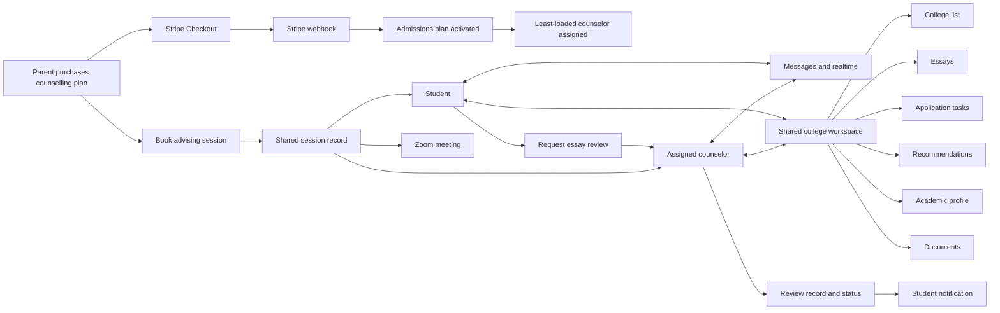

## 1. Counselor assignment

### Purpose

Counselor assignment establishes which professional is authorized to advise a student. The paid admissions plan is the relationship of record. The application workspace may exist before or after the engagement, so it is not used as the primary assignment source.

### Current flow

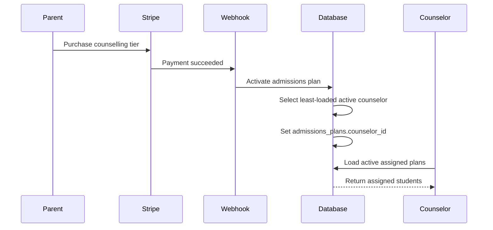

### Implemented rules

- The active counselor with the fewest `active` or `past_due` plans is selected.
- Assignment ties are broken by counselor creation date, producing a stable result.
- If no active counselor exists, the plan remains valid but unassigned.
- Existing live plans are backfilled when the assignment migration is applied.
- An administrator may later move the engagement to another counselor.
- `is_my_advisee(student_id)` identifies whether the signed-in counselor owns the student's active engagement.
- The counselor dashboard derives its student list from assigned admissions plans, not from partially created application workspaces.

### Data involved

- `profiles`
- `admissions_tiers`
- `admissions_plans`
- `college_guide_applications`

### Evidence

- `supabase/migrations/20260803000200_counselor_assignment.sql`
- `src/services/counselorService.ts`
- `scripts/verify/counselor-assignment.sql`

## 2. Direct messaging

### Current flow

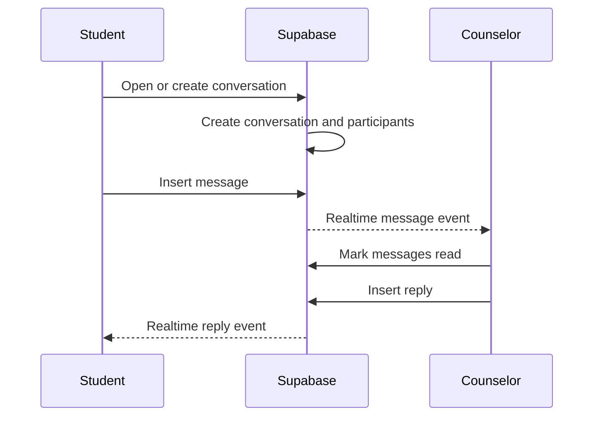

### Data involved

- `conversations`
- `conversation_participants`
- `messages`
- `message_reports`
- `conversation_flags`

### Implemented behavior

- `get_or_create_conversation` atomically finds or creates a one-to-one conversation.
- Messages are inserted optimistically and persisted in `messages`.
- Conversation timestamps are advanced after a send so active threads sort first.
- Unread messages are computed from sender and read status.
- Opening a thread marks messages from the other participant as read.
- A shared Supabase Realtime channel fans message changes out to all mounted listeners.
- Message reporting and conversation flagging provide moderation paths.
- Linked parents have a separate read-only monitoring view for their child's conversations.

### Finding: contact eligibility is too broad

`getContacts()` currently selects profiles broadly and filters them in the browser. The intended student-counselor boundary should derive eligible contacts from the active counselor assignment.

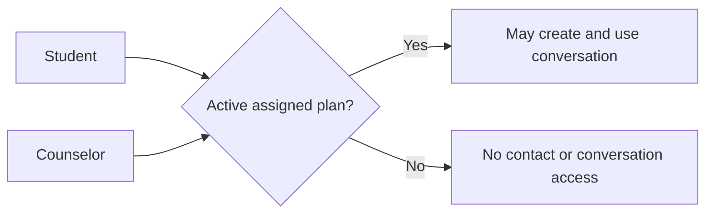

This matters because the architecture documentation identifies an existing overly broad `profiles` read policy, and the baseline conversation-participant policies should be reviewed together with it.

### Evidence

- `src/services/messageService.ts`
- `src/services/reports/messageReports.ts`
- `supabase/migrations/20260731000000_baseline_remote_schema.sql`
- `docs/architecture/data-model.md`

## 3. Shared admissions workspace

The counselor's student-detail page embeds the same application-tracker and college-list components used by students. Both users therefore read and write the same records.

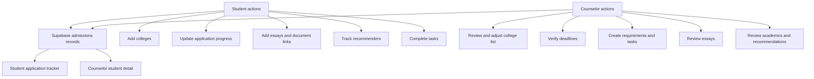

### Record-level flows

| Record | Student flow | Counselor flow |
| --- | --- | --- |
| Application profile | Supplies program, stage, year, and application information | Reviews or updates planning information and counselor notes |
| College list | Adds and prioritizes colleges | Adds colleges, adjusts strategy, and verifies deadlines |
| Requirements | Marks progress | Creates, edits, and monitors requirements |
| Essays | Adds prompt, draft link, due date, and review status | Reviews, returns, approves, or reopens |
| Tasks | Updates status | Creates and manages tasks and due dates |
| Academics | Supplies GPA, testing, and AP information | Reviews academic context for planning |
| Recommendations | Tracks recommenders and status | Reviews progress and outstanding needs |
| Documents | Supplies transcript, scores, essays, and references | Reviews available material |

### Data involved

- `college_guide_applications`
- `college_list_items`
- `application_requirements`
- `application_tasks`
- `essays`
- `essay_reviews`
- `student_academics`
- `recommendations`
- `student_documents`

### Evidence

- `src/pages/counselor/CounselorStudents.tsx`
- `src/pages/student/StudentApplicationTracker.tsx`
- `src/pages/student/StudentCollegeList.tsx`
- `src/services/collegeService.ts`

## 4. College and deadline verification

The data model distinguishes user-entered information from counselor-verified information.

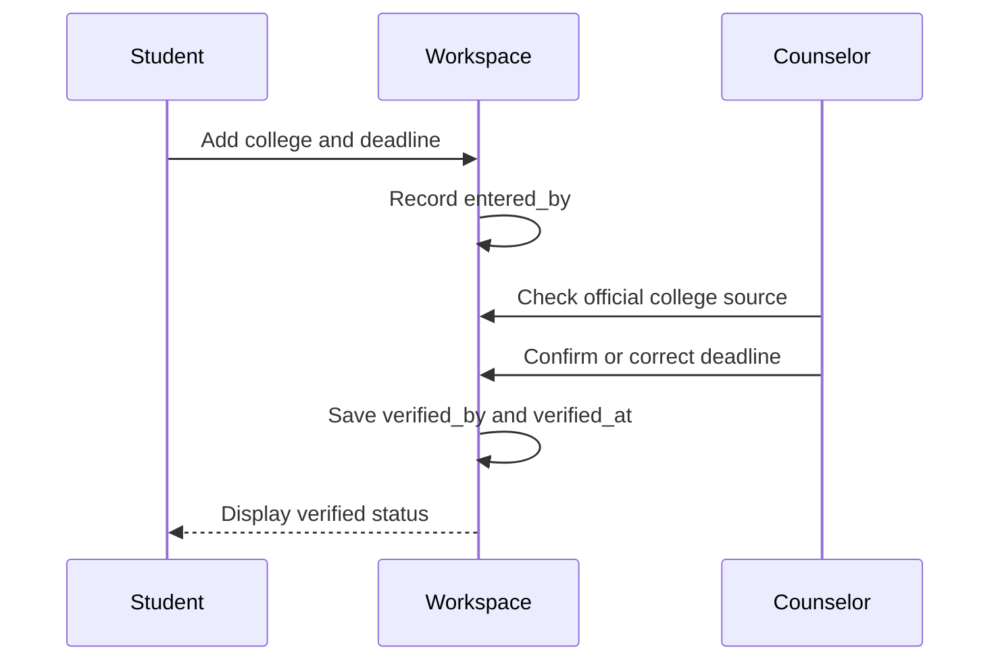

The college-list record can preserve:

- Who entered the information.
- Which counselor verified it.
- When verification happened.
- An optional verification note.

This is a strong audit pattern for consequential deadlines. The same pattern should be considered for other consequential changes such as application submission status and school removal.

### Evidence

- `src/services/collegeService.ts`
- `src/components/college/VerifiedBadge.tsx`

## 5. Essay review

Essay composition and inline comments live in Google Docs. Yakal owns the workflow status, review history, round count, and student notification.

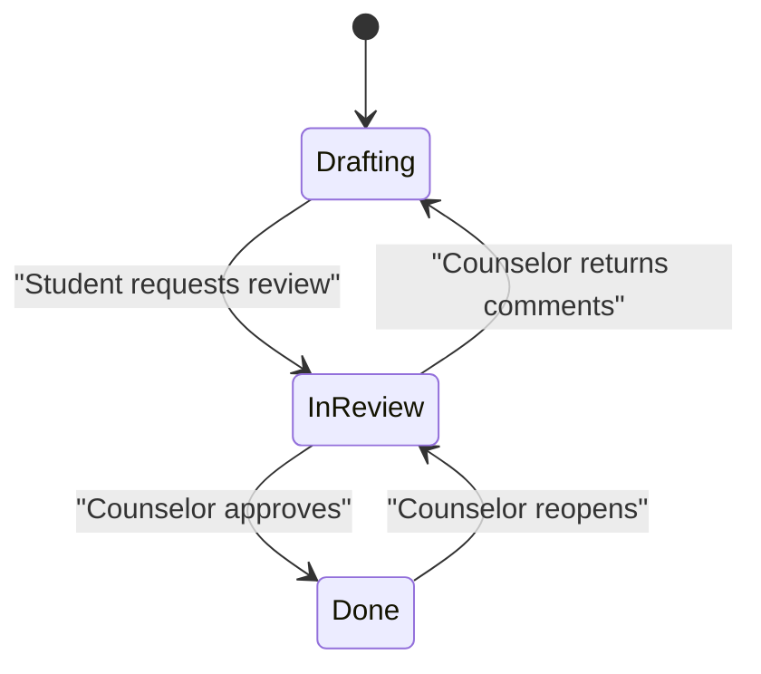

### Review record

Each `essay_reviews` row records:

- Essay ID
- Counselor ID
- Review action
- Optional note
- Timestamp

Returning or approving an essay consumes a review round. Reopening does not consume a round because it corrects the counselor's own earlier action.

### Write sequence

1. Insert the review-log row.
2. Update the essay status.
3. Notify the student when the essay is returned or approved.

The log is intentionally written first. A preserved review receipt with a temporarily stale status is considered safer than losing evidence of a delivered review round.

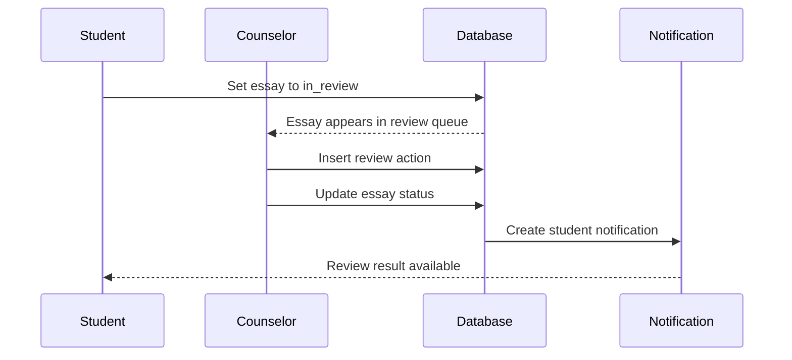

### Finding: notification route is stale

Essay-review notifications currently link to `/student/essays`. The router does not register that route. The student admissions workspace is registered at `/student/my-app`.

Likely impact: selecting an essay-review notification may land on the not-found page instead of the reviewed essay.

### Evidence

- `src/services/essayReviewService.ts`
- `src/pages/counselor/CounselorEssays.tsx`
- `src/app/Router.tsx`

## 6. Advising sessions

### Current intended flow

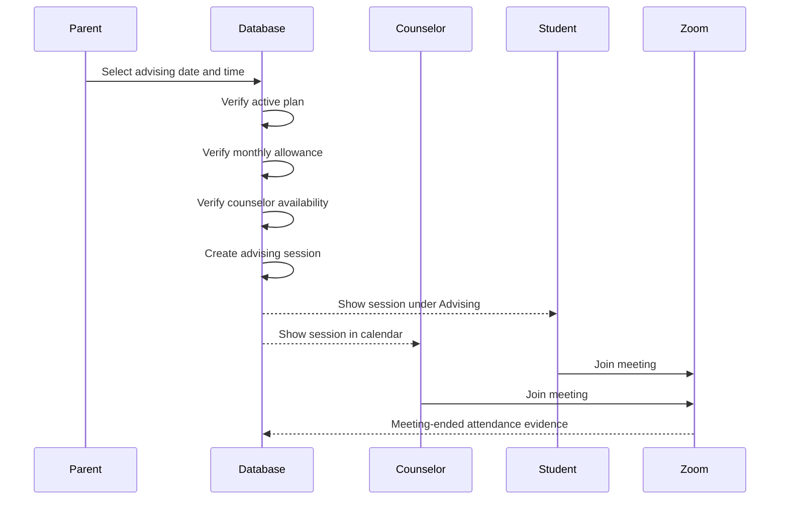

### Database rules

- The caller must be the student or an actively linked parent.
- The student must have an `active` or `past_due` counselling plan.
- A counselor must be assigned to the plan.
- The requested time must be in the future.
- The tier's monthly advising allowance is enforced in PostgreSQL.
- The counselor cannot already have another non-cancelled session in the slot.
- Advising sessions are stored in the shared `sessions` table with `kind = 'advising'`.
- The assigned counselor is stored in `sessions.tutor_id`.
- Canceling before the session starts releases the calendar slot and monthly allowance.

### Student view

The student Advising page shows:

- Advising hours used this month.
- Tier allowance.
- Upcoming sessions.
- Past sessions.
- Cancellation controls.

### Finding: booking authority is inconsistent

The student Advising page states that the parent books sessions from billing. The database function permits the student or an actively linked parent to book.

One product rule must be selected and applied consistently:

| Option | Advantages | Trade-off |
| --- | --- | --- |
| Parent-only booking | Parent controls paid service and family calendar | Older students cannot manage their own advising schedule |
| Student or parent booking | Matches the current database function and supports student ownership | Requires clear shared-calendar expectations and duplicate-action handling |

### Finding: counselor session query uses the wrong column

`book_advising_session` inserts the counselor into `sessions.tutor_id`. The `sessions` table does not define a `counselor_id` column. However, `getCounselorSessionsFull()` filters with `.eq("counselor_id", counselorId)`.

Likely impact: counselor session lists and calendars may fail or appear empty, even though direct session-detail access can work through `tutor_id` RLS.

The query should use `tutor_id` and, where necessary, `kind IN ('advising', 'mock_interview')` to prevent tutoring lessons from being mixed into the counselor view.

### Completion and attendance

- Zoom attendance is evidence, not the sole completion gate.
- A Zoom meeting with no participants can hold the session for review.
- In-person sessions cannot rely on Zoom evidence.
- Completion is automated after the scheduled end time.
- A hold period keeps earnings reversible while a disputed session is reviewed.

### Evidence

- `supabase/migrations/20260803000300_book_advising.sql`
- `src/pages/student/StudentAdvising.tsx`
- `src/services/counselorService.ts`
- `docs/architecture/integrations.md`

## 7. Notifications

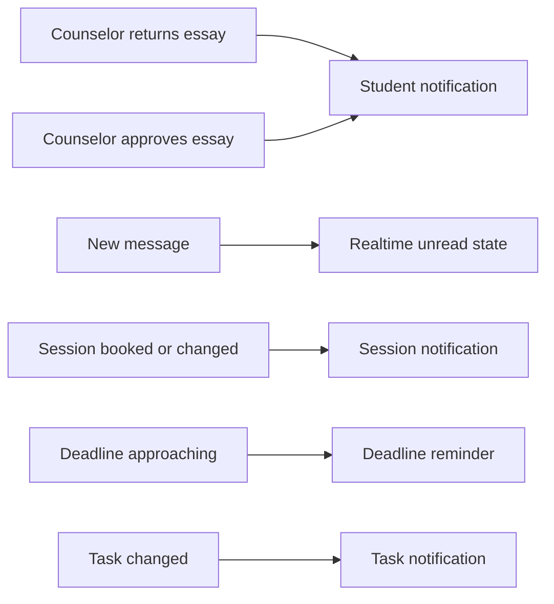

Essay-review notifications and realtime message unread state are the clearest implemented student-counselor notification paths. Additional admissions templates exist, but the repository documents notification gaps and some template routes do not match the active router.

Potential counselor-to-student notifications should include:

- Essay returned
- Essay approved
- New counselor message
- Application task assigned or changed
- College deadline verified or corrected
- Advising session booked, rescheduled, or cancelled
- Upcoming advising reminder
- Application requirement approaching its due date

Potential student-to-counselor notifications should include:

- Essay submitted for review
- Student replied to feedback
- New student message
- Required document uploaded
- Application status changed
- Advising session cancelled or rescheduled

## 8. Access-control analysis

### Intended boundary

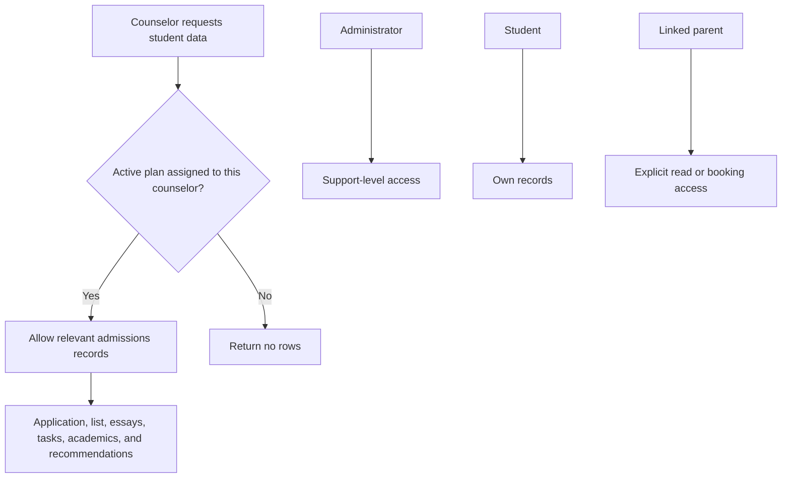

### Finding: assignment-scoped RLS is incomplete

The counselor-assignment migration correctly replaces broad counselor policies on:

- `admissions_plans`
- `college_guide_applications`

However, the baseline schema contains counselor-wide policies on several related tables that use `is_counselor()` rather than `is_my_advisee(student_id)`:

- `college_list_items`
- `application_requirements`
- `application_tasks`
- `essays`
- `recommendations`
- `student_academics`

`student_documents` policies should also be reviewed to ensure the same relationship boundary.

This means the application shell may be assignment-scoped while the underlying child records remain accessible to counselors who are not assigned to that student.

### Risk

These records can contain:

- Personal statements
- College choices
- Application deadlines
- Academic scores
- Recommendation details
- Counselor notes
- Document references

The incomplete policy boundary is the highest-priority finding in this report.

### Target policy pattern

For tables with a direct `student_id`:

```sql
USING (
  public.is_counselor()
  AND public.is_my_advisee(student_id)
)
```

For `application_requirements`, the policy must resolve the student through the related `college_list_items` row.

Any replacement migration should:

1. Drop the counselor-wide policy.
2. Add an assignment-scoped policy.
3. Preserve student, linked-parent, and admin behavior deliberately.
4. Revoke unnecessary grants and re-grant only required operations.
5. Include verification proving that Counselor A cannot see or edit Counselor B's students.

## 9. Current versus possible flows

| Flow | Current status | Recommended direction |
| --- | --- | --- |
| Counselor assignment | Implemented | Keep least-loaded assignment and add admin reassignment audit history |
| Assigned student list | Implemented | Keep plan-driven list |
| Direct realtime messages | Implemented | Restrict contact discovery to authorized relationships |
| Shared college list | Implemented | Complete assignment-scoped RLS |
| Deadline verification | Implemented | Add student notification when verified or corrected |
| Shared application tracker | Implemented | Clarify field ownership and audit consequential changes |
| Essay review history | Implemented | Fix destination route and add deep link to the essay |
| Advising allowance | Implemented | Keep database enforcement |
| Advising booking | Implemented with inconsistent UI rule | Decide parent-only versus shared booking authority |
| Counselor session list | Likely broken | Query `sessions.tutor_id` and filter counselling kinds |
| Zoom attendance evidence | Implemented conditionally | Preserve as evidence, not the only completion gate |
| Document collaboration | Partially represented | Define upload, visibility, review, and notification lifecycle |
| Task assignment notifications | Partial or absent | Notify student on create, due-date change, and completion feedback |
| Deadline reminders | Partial or absent | Add scheduled reminders with deduplication |
| Counselor reassignment history | Not evident | Add audit record and inform the family and both counselors |

## 10. Recommended target flow

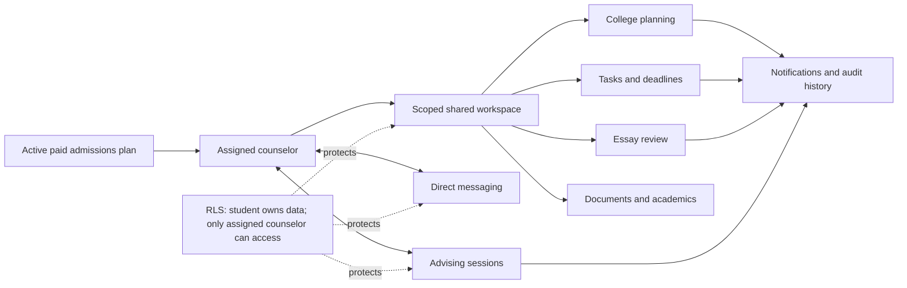

## 11. Recommended ownership matrix

Before changing the flow, the product should explicitly decide who may edit each record.

| Data | Student | Assigned counselor | Linked parent | Admin |
| --- | --- | --- | --- | --- |
| Student profile | Own fields | Read advising-relevant fields | Defined child view | Support access |
| Academic data | Create and update | Read, possibly annotate | Read | Support access |
| College list | Create and update | Create, update, verify | Read or add by defined rule | Read/support |
| Deadlines | Propose | Verify and correct | Read | Read/support |
| Requirements | Complete | Create and manage | Read | Read/support |
| Essays | Create and edit document reference | Review and change workflow status | Read status only | Read/support |
| Recommendations | Create and track | Advise and update defined fields | Read | Read/support |
| Tasks | Complete | Create and manage | Read | Read/support |
| Messages | Send and receive | Send and receive | Read-only monitoring by explicit policy | Moderation access |
| Advising sessions | View, cancel, possibly book | View, conduct, add notes | Book, view, cancel | Support access |
| Counselor notes | No direct edit | Create and update | No access unless explicitly intended | Support access |

## 12. Prioritized recommendations

### Priority 0: privacy and authorization

1. Replace counselor-wide admissions policies with assignment-scoped policies on every related table.
2. Restrict messaging contacts and conversation creation to valid platform relationships.
3. Review `profiles` and `conversation_participants` policies together with the admissions policy migration.
4. Add cross-counselor negative tests for reads, inserts, updates, and deletes.

### Priority 1: broken or contradictory flows

1. Change counselor session queries from `counselor_id` to `tutor_id` and filter advising session kinds.
2. Fix essay-review notification links to an active route, preferably a deep link to the specific essay.
3. Decide whether students may book advising and align UI copy, controls, and database authorization.
4. Audit all admissions notification template routes against `Router.tsx`.

### Priority 2: workflow clarity

1. Define jointly editable, counselor-only, student-only, and read-only fields.
2. Add visible attribution for counselor-created tasks and counselor-verified deadlines.
3. Add an audit trail for counselor reassignment and consequential application changes.
4. Add notifications for session changes, review requests, task assignments, and deadline corrections.

### Priority 3: operational improvements

1. Add scheduled, deduplicated deadline reminders.
2. Add counselor workload indicators for review queue age and approaching deadlines.
3. Add deep links from messages and notifications to the relevant student, essay, task, or session.
4. Add a clear exception workflow for disputed or missed advising sessions.

## 13. Suggested verification coverage

The following verification scenarios would pin the intended behavior:

### Assignment boundary

- Assigned counselor can read the student's full admissions workspace.
- Unassigned counselor receives zero rows from every admissions table.
- Unassigned counselor cannot insert, update, or delete related records.
- Reassignment removes old-counselor access and grants new-counselor access.
- Student and linked parent retain intended access after reassignment.

### Messaging

- Student can create a conversation with the assigned counselor.
- Student cannot create a conversation with an unrelated counselor.
- Counselor cannot enumerate unrelated student contacts.
- Both participants receive realtime inserts and read-state updates.
- Linked parent monitoring remains read-only.

### Essay review

- Student submission enters the assigned counselor's queue.
- Only the assigned counselor can write the review.
- Return and approval consume a round; reopen does not.
- Notification opens the correct essay or application view.

### Advising

- Booking requires an active plan and assigned counselor.
- Monthly limit cannot be bypassed from the browser.
- Counselor conflicts and student conflicts are rejected.
- Counselor list and calendar show the newly booked session.
- Cancellation before start releases the allowance.
- Cancellation after start is rejected.

## 14. Primary repository references

- `docs/architecture/README.md`
- `docs/architecture/data-model.md`
- `docs/architecture/api.md`
- `docs/architecture/integrations.md`
- `src/app/Router.tsx`
- `src/services/counselorService.ts`
- `src/services/collegeService.ts`
- `src/services/essayReviewService.ts`
- `src/services/messageService.ts`
- `src/services/admissionsService.ts`
- `src/pages/counselor/CounselorStudents.tsx`
- `src/pages/counselor/CounselorEssays.tsx`
- `src/pages/student/StudentAdvising.tsx`
- `src/pages/student/StudentApplicationTracker.tsx`
- `src/pages/student/StudentCollegeList.tsx`
- `supabase/migrations/20260731000000_baseline_remote_schema.sql`
- `supabase/migrations/20260803000200_counselor_assignment.sql`
- `supabase/migrations/20260803000300_book_advising.sql`
- `supabase/migrations/20260801000400_countable_deliverables.sql`
- `scripts/verify/counselor-assignment.sql`
- `scripts/verify/admissions.mjs`
- `scripts/verify/messaging.mjs`
